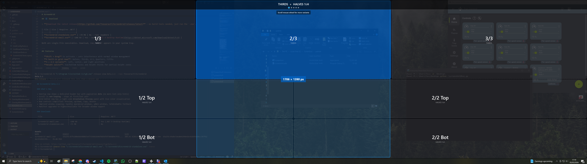

<p align="center">
  
  
  
</p>

# ScreenGrid

<p align="center">
  <a href="https://github.com/TtesseractT/ScreenGrid/releases/latest/download/ScreenGridSetup.exe">
    
  </a>
  &nbsp;
  <a href="https://github.com/TtesseractT/ScreenGrid/releases/latest/download/ScreenGrid-standalone.exe">
    
  </a>
  &nbsp;
  <a href="https://github.com/TtesseractT/ScreenGrid/releases/latest/download/ScreenGrid-small.exe">
    
  </a>
</p>

A lightweight, open-source window-snapping tool for **ultrawide monitors** on Windows. Hold **Shift** while dragging any window to see a customizable grid overlay, then drop onto a zone to snap instantly.

Built for displays like 5120×1440 where Windows' built-in snap (halves/quarters) leaves too much wasted space.


<!-- Replace with an actual screenshot once you have one -->

---
## ⬇️ Download

> **[Download the latest release](https://github.com/TtesseractT/ScreenGrid/releases/latest)** - no build tools needed.

| File | Size | Description |
|------|------|-------------|
| **ScreenGridSetup.exe** | ~66 MB | **Installer** - installs to Program Files, adds to Windows startup, creates Start Menu & optional desktop shortcut. Includes uninstaller. |
| **ScreenGrid-standalone.exe** | ~70 MB | Portable single-file exe, no .NET required |
| **ScreenGrid-small.exe** | ~200 KB | Portable single-file exe, needs [.NET 9 Desktop Runtime](https://dotnet.microsoft.com/download/dotnet/9.0) |

**Recommended:** Use the installer for an automatic startup experience.

---
## Features

- **Shift + Drag** to activate - zero interference with normal window management
- **5 built-in grid rows**: Halves, Thirds, 4:3, Quarters, Fifths
- **3 × 4:3 variants**: left, center, and right positions
- **Height splits**: top/bottom halves and height thirds for partial-height zones
- **Custom grids** - create any ratio (2:1, 3:2:1, 16:9, etc.) via the built-in editor
- **Save / Load** grid layouts as `.screengrid` JSON files
- **Full-height snap preview** with pixel dimensions shown on hover
- **DPI-aware** (PerMonitorV2) - works on mixed-DPI multi-monitor setups
- **Click-through overlay** - never steals focus or interferes with your drag
- **System tray only** - no visible window, runs silently in the background
- **Run at Startup** toggle - enable/disable from the tray menu or via the installer
- **Windows installer** - proper install/uninstall with auto-startup support
- **~200 KB** framework-dependent exe (or ~70 MB self-contained)

---

## Quick Start

### Option 1: Download a Release

> **[⬇️ Download the latest release](https://github.com/TtesseractT/ScreenGrid/releases/latest)** and run the `.exe`. It sits in your system tray.

### Option 2: Build from Source

**Prerequisites:** [.NET 9 SDK](https://dotnet.microsoft.com/download/dotnet/9.0), Windows 10+

```powershell
git clone https://github.com/TtesseractT/ScreenGrid.git
cd ScreenGrid
dotnet run -c Release
```

---

## Usage

| Action | Result |
|--------|--------|
| **Shift + Drag** a window | Grid overlay appears |
| **Hover** over a zone | Zone highlights, full-height snap preview shown |
| **Release mouse** on a zone | Window snaps to that column (full height) |
| **Release Shift** while dragging | Cancel - overlay hides, no snap |

### System Tray Menu (right-click)

| Option | Description |
|--------|-------------|
| **Create / Edit Grid** | Open the grid editor to add, remove, reorder rows |
| **Load Grid from File…** | Import a `.screengrid` JSON layout |
| **Reset Grid to Defaults** | Restore all 5 built-in grid rows |
| **Run at Startup** | Toggle Windows startup registration (checked = enabled) |
| **How to use** | Quick usage guide |
| **Exit** | Close ScreenGrid |

---

## Custom Grids

Right-click the tray icon → **Create / Edit Grid** to open the editor:

- Use **preset buttons** to quickly add common rows (Halves, Thirds, 4:3, etc.)
- Click **+ Custom…** to enter any ratio - e.g. `3:2:1` or `16:9`
- **Reorder** rows with ▲/▼ - top row appears at the top of the overlay
- **Rename** rows to anything you like
- Click **Apply & Close** to activate immediately
- Click **Save to File…** to export and share your layout

Grid configs are stored as simple JSON:

```json
{
  "name": "My Layout",
  "rows": [
    { "name": "HALVES", "ratios": [1, 1] },
    { "name": "Wide + Sidebar", "ratios": [3, 1] },
    { "name": "THIRDS", "ratios": [1, 1, 1] },
    { "name": "16:9 Split", "ratios": [16, 9] }
  ]
}
```

---

## Default Grid Layout (5120 × 1440)

```
┌──────────────────────────────────────────────────────────────┐
│  HALVES                                                      │
│  ┌────────────────────────┐ ┌────────────────────────┐       │
│  │     1/2  (2560px)      │ │     2/2  (2560px)      │       │
│  └────────────────────────┘ └────────────────────────┘       │
├──────────────────────────────────────────────────────────────┤
│  THIRDS                                                      │
│  ┌──────────────┐ ┌──────────────┐ ┌──────────────┐         │
│  │    1/3       │ │    2/3       │ │    3/3       │         │
│  └──────────────┘ └──────────────┘ └──────────────┘         │
├──────────────────────────────────────────────────────────────┤
│  4:3 LEFT        4:3 CENTER        4:3 RIGHT                  │
│  ┌─────────┐┌────┐  ┌───┐┌────────┐┌───┐  ┌────┐┌─────────┐       │
│  │   4     ││  3 │  │ 3 ││   4    ││ 3 │  │  3 ││    4    │       │
│  └─────────┘└────┘  └───┘└────────┘└───┘  └────┘└─────────┘       │
├──────────────────────────────────────────────────────────────┤
│  QUARTERS                                                    │
│  ┌──────────┐ ┌──────────┐ ┌──────────┐ ┌──────────┐       │
│  │   1/4    │ │   2/4    │ │   3/4    │ │   4/4    │       │
│  └──────────┘ └──────────┘ └──────────┘ └──────────┘       │
├──────────────────────────────────────────────────────────────┤
│  FIFTHS                                                      │
│  ┌────────┐ ┌────────┐ ┌────────┐ ┌────────┐ ┌────────┐   │
│  │  1/5   │ │  2/5   │ │  3/5   │ │  4/5   │ │  5/5   │   │
│  └────────┘ └────────┘ └────────┘ └────────┘ └────────┘   │
├──────────────────────────────────────────────────────────────┤
│  TOP / BOTTOM  (full width, snaps to half the screen height)  │
│  ┌────────────────────────────────────────────────┐       │
│  │          1/1 Top  (5120 × 720)                  │       │
│  ├────────────────────────────────────────────────┤       │
│  │          1/1 Bot  (5120 × 720)                  │       │
│  └────────────────────────────────────────────────┘       │
├──────────────────────────────────────────────────────────────┤
│  HEIGHT ⅓  (full width, snaps to ⅓ screen height)             │
│  ┌────────────────────────────────────────────────┐       │
│  │          1/1 Top  (5120 × 480)                  │       │
│  ├────────────────────────────────────────────────┤       │
│  │          1/1 Mid  (5120 × 480)                  │       │
│  ├────────────────────────────────────────────────┤       │
│  │          1/1 Bot  (5120 × 480)                  │       │
│  └────────────────────────────────────────────────┘       │
└──────────────────────────────────────────────────────────────┘
```

Full-height rows snap windows to the **full height** of the work area.
Height-split rows (Top/Bottom, Height ⅓) snap windows to **partial height**.

---

## Publishing

### Framework-dependent (~200 KB, requires .NET 9 on target)

```powershell
dotnet publish -c Release -r win-x64 --no-self-contained -p:PublishSingleFile=true -p:EnableCompressionInSingleFile=false -o ./publish-small
```

### Self-contained (~70 MB, no .NET required)

```powershell
dotnet publish -c Release -r win-x64 --self-contained -p:PublishSingleFile=true -o ./publish
```

### Installer (~66 MB, includes auto-startup)

Requires [Inno Setup 6](https://jrsoftware.org/isinfo.php):

```powershell
# First publish the self-contained exe (above), then:
& "C:\Program Files (x86)\Inno Setup 6\ISCC.exe" installer/ScreenGridSetup.iss
# Output: installer-output/ScreenGridSetup.exe
```

---

## Run at Windows Startup

**Option A: Use the installer** (recommended)

Download `ScreenGridSetup.exe` — during installation, the "Run at startup" option is checked by default.

**Option B: Toggle from the app**

Right-click the tray icon → check **Run at Startup**. This writes to `HKCU\...\Run` (current user only, no admin required).

**Option C: Manual shortcut**

1. Press `Win+R` → type `shell:startup` → Enter
2. Create a shortcut to `ScreenGrid.exe` in that folder

---

## Architecture

```
ScreenGrid/
├── App.xaml.cs                 # Entry point, tray icon, WinEvent hook, drag tracking
├── OverlayWindow.xaml.cs       # Full-screen transparent overlay, grid rendering
├── GridEditorWindow.xaml.cs    # Grid editor UI (add/remove/reorder rows, height ratios)
├── CustomRatioDialog.xaml.cs   # Dialog for entering custom ratios
├── GridConfig.cs               # Grid layout model, JSON serialization
├── GridZone.cs                 # Individual snap zone model
├── NativeMethods.cs            # Win32 P/Invoke declarations
├── StartupManager.cs           # Windows startup registry management
├── ScreenGrid.csproj           # .NET 9 WPF project
├── installer/                  # Inno Setup installer script
└── tests/                      # xUnit test suite
```

**Key Win32 APIs:**
- `SetWinEventHook` - detects window drag start/end system-wide
- `GetAsyncKeyState` - polls Shift key state at 60 fps
- `GetCursorPos` - tracks cursor position during drag
- `MoveWindow` - snaps the window to the target zone
- `DwmGetWindowAttribute` - compensates for invisible DWM borders
- `GetMonitorInfo` / `GetDpiForMonitor` - multi-monitor and DPI support

---

## Contributing

Contributions are welcome! See [CONTRIBUTING.md](CONTRIBUTING.md) for guidelines.

---

## License

[MIT](LICENSE) - free to use, modify, and distribute.
